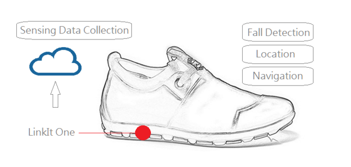

## IoT-SmartCare_Shoes

##Overview
A IoT project using Linkit One board and written in C. 
[Demo Video](https://youtu.be/CeFWwi-kcDA)
##Detail Report
[Report](https://drive.google.com/file/d/0B796WVmsjTFnSERwdnBhdmlDUzA/view?usp=sharing)
##Award
[2015 Mobileheroes Communication Contest IoT/Wearable Device--Honorable Mentions](https://drive.google.com/file/d/0B796WVmsjTFnWGJKeE1tUEpqZG8/view?usp=sharing) 
Team : EPLaboratory
